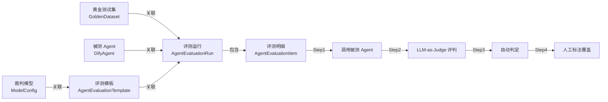

# Agent 评测功能 — 操作文档

## 一、功能概述

本次重构将 Agent 评测模块升级为一套完整的 **黄金测试集驱动的 Agent 评测平台**，支持以下核心能力：

| 能力 | 说明 |
|------|------|
| 🗂️ 黄金测试集管理 | 独立维护标准 Q&A 数据集，支持手动添加和 Excel 批量导入，可复用于多次评测 |
| 🤖 被测 Agent 配置 | 支持 Dify Agent 和通用 HTTP API 两种 Agent 类型 |
| 🧪 评测执行 | 关联黄金测试集 → 逐条调用被测 Agent → LLM-as-Judge 语义评判 |
| ✏️ 人工标注覆盖 | 在执行结果上人工标记"应该正确"/"应该错误"，覆盖自动判定 |

---

## 二、系统架构



### 导航菜单结构

侧边栏 **Agent 评测** 展开为 5 个子页面：

| 菜单项 | 路由 | 功能 |
|--------|------|------|
| 评测执行 | `/agent-evaluation` | 创建评测任务、查看概览和明细、人工标注 |
| 黄金测试集 | `/agent-evaluation/golden-datasets` | 管理标准 Q&A 数据集 |
| 被测Agent管理 | `/agent-evaluation/badcases` | 配置 Dify/HTTP API Agent |
| 评测模板 | `/agent-evaluation/templates` | 管理 LLM-as-Judge 评判 prompt 模板 |
| 模型配置 | `/agent-evaluation/model-configs` | 管理裁判 LLM 模型密钥和端点 |

---

## 三、操作指南

### 3.1 黄金测试集管理

**入口**：侧边栏 → Agent 评测 → 黄金测试集

#### 创建测试集

1. 点击右上角 **「新建测试集」** 按钮
2. 填写：
   - **名称**：例如"客服场景标准问答集"
   - **描述**：测试集的用途说明（可选）
   - **标签**：输入后回车添加（可选）
3. 点击确定完成创建

#### 添加测试条目（手动）

1. 在测试集列表中点击名称，打开详情 Drawer
2. 点击右上角 **「手动添加」** 按钮
3. 在弹窗中逐条填写：
   - **问题**：用户提问内容
   - **期望答案**：标准答案（评判基准）
   - **分类**：问题分类标签（可选）
   - **优先级**：高/中/低
4. 可点击底部 **「添加条目」** 按钮继续添加更多条目
5. 点击确定批量保存

#### Excel 批量导入

1. 在列表页右上角点击 **「下载模板」** 按钮，获取标准 Excel 模板
2. 按模板格式填写数据（详见下方模板说明）
3. 打开某个测试集的详情 Drawer
4. 点击右上角 **「Excel 导入」** 按钮，选择填好的 Excel 文件
5. 系统自动解析并导入，显示成功/错误统计

##### Excel 模板格式（5 列）

| 列 | 是否必填 | 说明 |
|----|---------|------|
| A - 问题 | ✅ 必填 | 用户提问内容 |
| B - 期望答案 | ✅ 必填 | 标准答案（评判基准） |
| C - 分类 | ❌ 可选 | 问题分类标签 |
| D - 优先级 | ❌ 可选 | 填 `high` / `medium` / `low`，默认 `medium` |
| E - 标签 | ❌ 可选 | 多个标签用英文逗号分隔，如 `客服,售后` |

> **注意事项**：
> - 第 1 行为表头，请勿修改
> - 从第 2 行开始填写数据
> - 模板中灰色斜体行是示例数据，导入前请删除或覆盖

#### 编辑与删除

- 在详情 Drawer 的条目列表中，每行右侧有 **编辑** 和 **删除** 图标按钮
- 测试集本身也可以在列表页编辑名称/描述/标签，或整体删除（级联删除所有条目）

---

### 3.2 被测 Agent 配置

**入口**：侧边栏 → Agent 评测 → 被测Agent管理

#### 添加 Dify Agent

1. 点击 **「添加智能体」**
2. 选择类型为 **dify**
3. 填写：
   - **名称**：Agent 显示名称
   - **Base URL**：Dify API 地址，例如 `https://api.dify.ai/v1`
   - **App ID**：Dify 应用 ID
   - **API Key**：Dify API 密钥

#### 添加通用 HTTP API Agent

1. 点击 **「添加智能体」**
2. 选择类型为 **http_api**
3. 填写：
   - **名称**：Agent 显示名称
   - **Base URL**：API 端点地址，例如 `https://my-agent.example.com/chat`
   - **API Key**：Bearer Token（可选）
   - **请求配置**（JSON 格式）：

```json
{
  "method": "POST",
  "headers": {
    "Content-Type": "application/json"
  },
  "body_template": "{\"query\": \"{{question}}\"}",
  "answer_path": "data.answer"
}
```

> **说明**：
> - **answer_path** 支持点号分隔的路径提取，例如 `data.answer` 会从响应 JSON 中提取 `response["data"]["answer"]`
> - **body_template** 中的 `{{question}}` 会被替换为实际的问题内容

---

### 3.3 评测模板配置（可选）

**入口**：侧边栏 → Agent 评测 → 评测模板

评测模板定义了 LLM-as-Judge 的评判 Prompt，支持自定义评分标准。

1. 点击 **「新建模板」**
2. 填写：
   - **名称**：例如"语义一致性评判"
   - **评测模式**：`LLM`（语义评判）或 `F1`（关键词覆盖率）
   - **系统提示词**：裁判 LLM 的 system prompt
   - **用户提示词**：支持变量 `{{query}}`、`{{expected_answer}}`、`{{answer}}`
   - **模型配置**：选择裁判 LLM 模型
   - **通过阈值**：0-1 的分数阈值

#### 内置默认 Prompt

如果不使用模板，系统会自动使用内置的语义评判 Prompt：

```
你是一个专业的AI回答质量评估专家。评估AI回答与期望答案的语义一致性。
请以JSON格式返回：{"score": <0到1的分数>, "reason": <评估理由>}
```

---

### 3.4 创建评测任务

**入口**：侧边栏 → Agent 评测 → 评测执行

#### 操作步骤

1. 在左侧 **「新建评测」** 面板中填写：

   | 字段 | 说明 | 必填 |
   |------|------|------|
   | 任务名称 | 评测任务标识 | ✅ |
   | 黄金测试集 | 下拉选择已创建的测试集 | ✅ |
   | 被测 Agent | 下拉选择已配置的 Agent | ✅ |
   | 评测模板 | 选择预设的评判模板（选择后自动填充评测模式和模型配置） | ❌ |
   | 评测模式 | LLM 语义评判 / F1 关键词覆盖 | ✅ |
   | 裁判模型配置 | LLM 模式下选择裁判模型 | LLM模式需要 |
   | 通过阈值 | 0-1 的分数阈值，默认 0.55 | ✅ |

2. 点击 **「开始评测」** 按钮
3. 系统自动：
   - 从黄金测试集加载所有 Q&A 条目
   - 逐条调用被测 Agent 获取实际回答
   - 使用裁判 LLM 进行语义评判（或 F1 关键词匹配）
   - 自动判定通过/不通过

#### 评测概览

右侧上方卡片显示实时概览：
- **进度条**：评测完成进度
- **统计面板**：总数、通过、不通过、失败、通过率、人工覆盖数
- 运行中的任务每 2 秒自动刷新

#### 评测明细

右侧中部表格显示每条评测的详细结果：

| 列 | 说明 |
|----|------|
| 问题 | 黄金测试集中的原始问题 |
| 期望答案 | 标准答案 |
| 实际回答 | 被测 Agent 返回的回答 |
| 自动判定 | 系统自动评判结果（通过/不通过/失败） |
| 得分 | 0-1 的评分 |
| 最终判定 | 考虑人工标注后的最终结论 |
| 原因 | 评判理由 |
| 耗时 | 调用耗时(ms) |
| 操作 | 查看详情、标记正确/错误、撤销标注 |

---

### 3.5 人工标注覆盖

对于自动判定结果，支持人工覆盖：

#### 标记操作

在评测明细表格的操作列中：

- **✓ 标记正确**（绿色按钮）：将自动判定为"不通过"的条目标记为"应该正确"
- **✗ 标记错误**（红色按钮）：将自动判定为"通过"的条目标记为"应该错误"
- **↩ 撤销标注**：撤销之前的人工标注，恢复自动判定

#### 统计影响

人工标注会实时更新统计数据：
- **通过数** = 自动通过且未被标记为错误 + 自动不通过但被标记为正确
- **不通过数** = 自动不通过且未被标记为正确 + 自动通过但被标记为错误
- **人工覆盖数** = 所有有人工标注的条目数

#### 查看详情

点击每条结果的 **👁 查看详情** 按钮，打开 Drawer 展示：
- 完整的问题和答案文本
- 评判得分和原因
- 人工标注状态和备注
- LLM 评判原文（如使用 LLM 模式）

---

## 四、历史记录

评测执行页面底部展示所有历史评测任务：

| 列 | 说明 |
|----|------|
| 评测任务 | 可点击切换到该任务的概览和明细 |
| 被测Agent | 关联的 Agent 名称 |
| 测试集 | 关联的黄金测试集名称 |
| 模式 | F1 关键词 / LLM 语义 |
| 状态 | 待执行/运行中/已完成/失败 |
| 通过率 | 百分比 |
| 人工覆盖 | 人工标注条目数 |
| 操作 | 删除 |

---

## 五、API 接口参考

### 黄金测试集

| 方法 | 路径 | 说明 |
|------|------|------|
| `GET` | `/api/v1/golden-datasets` | 列表（支持 `keyword`、`limit`、`offset` 参数） |
| `POST` | `/api/v1/golden-datasets` | 创建测试集（可含初始条目） |
| `GET` | `/api/v1/golden-datasets/template/download` | 下载 Excel 导入模板 |
| `GET` | `/api/v1/golden-datasets/{id}` | 详情（含所有条目） |
| `PUT` | `/api/v1/golden-datasets/{id}` | 更新测试集信息 |
| `DELETE` | `/api/v1/golden-datasets/{id}` | 删除测试集（级联删除条目） |
| `POST` | `/api/v1/golden-datasets/{id}/items` | 批量添加条目 |
| `POST` | `/api/v1/golden-datasets/{id}/import-excel` | Excel 文件导入条目（multipart/form-data） |
| `PUT` | `/api/v1/golden-dataset-items/{id}` | 更新单条条目 |
| `DELETE` | `/api/v1/golden-dataset-items/{id}` | 删除单条条目 |

### 评测运行

| 方法 | 路径 | 说明 |
|------|------|------|
| `GET` | `/api/v1/agent-evaluation/providers` | 获取可用选项（模型、Agent、测试集） |
| `GET` | `/api/v1/agent-evaluation/runs` | 评测运行列表 |
| `GET` | `/api/v1/agent-evaluation/runs/{id}` | 运行详情（含明细） |
| `POST` | `/api/v1/agent-evaluation/runs` | 创建评测运行（后台异步执行） |
| `DELETE` | `/api/v1/agent-evaluation/runs/{id}` | 删除运行记录 |

### 人工标注

| 方法 | 路径 | 说明 |
|------|------|------|
| `PUT` | `/api/v1/agent-evaluation/items/{id}/human-label` | 设置人工标注 |
| `DELETE` | `/api/v1/agent-evaluation/items/{id}/human-label` | 撤销人工标注 |

**请求体示例**（设置人工标注）：
```json
{
  "human_label": "correct",
  "human_comment": "该回答虽然措辞不同但语义正确"
}
```

---

## 六、变更文件清单

### 后端

| 操作 | 文件路径 | 说明 |
|------|---------|------|
| 修改 | `backend/models/database_models.py` | 新增 GoldenDataset/Item 表，扩展 DifyAgent/Run/Item 表 |
| 重写 | `backend/schemas/agent_evaluation_schemas.py` | 完整重写，新增所有新 Schema |
| 修改 | `backend/schemas/badcase_schemas.py` | DifyAgent 相关 Schema 扩展 agent_type/request_config |
| 新增 | `backend/services/golden_dataset_service.py` | 黄金测试集 CRUD 服务 |
| 重写 | `backend/services/agent_evaluation_service.py` | Agent 调用、评测执行、人工标注 |
| 修改 | `backend/services/badcase_service.py` | serialize_agent/create_agent 扩展 |
| 新增 | `backend/api/v1/golden_datasets.py` | 黄金测试集 REST API + Excel 导入导出 |
| 重写 | `backend/api/v1/agent_evaluation.py` | 评测运行 + 人工标注 API |
| 修改 | `backend/api/v1/badcases.py` | 补充 BadCaseTurn 导入 |
| 修改 | `backend/main.py` | 注册路由 + 自动迁移 |
| 修改 | `backend/api/deps.py` | 注册 golden_dataset_service |

### 前端

| 操作 | 文件路径 | 说明 |
|------|---------|------|
| 修改 | `frontend/src/services/api.ts` | 新增 goldenDatasetApi（含模板下载/Excel导入），扩展 agentEvaluationApi |
| 新增 | `frontend/src/pages/AgentEvaluation/GoldenDatasets.tsx` | 黄金测试集管理页面 |
| 重写 | `frontend/src/pages/AgentEvaluation.tsx` | 评测执行主页面 |
| 修改 | `frontend/src/App.tsx` | 新增路由 |
| 修改 | `frontend/src/components/Layout/ResponsiveLayout.tsx` | Agent 评测子菜单展开 |

### 数据库变更

启动时自动迁移（`_auto_migrate_columns`），无需手动执行 SQL：

| 表 | 新增列 | 类型 |
|----|--------|------|
| `golden_datasets` | 整表新建 | — |
| `golden_dataset_items` | 整表新建 | — |
| `dify_agents` | `agent_type` | VARCHAR(20) DEFAULT 'dify' |
| `dify_agents` | `request_config` | JSON |
| `agent_evaluation_runs` | `dataset_id` | INT NULL |
| `agent_evaluation_runs` | `agent_id` | INT NULL |
| `agent_evaluation_runs` | `human_override_count` | INT DEFAULT 0 |
| `agent_evaluation_items` | `dataset_item_id` | INT NULL |
| `agent_evaluation_items` | `human_override` | TINYINT(1) DEFAULT 0 |
| `agent_evaluation_items` | `human_label` | VARCHAR(20) NULL |
| `agent_evaluation_items` | `human_comment` | TEXT NULL |
